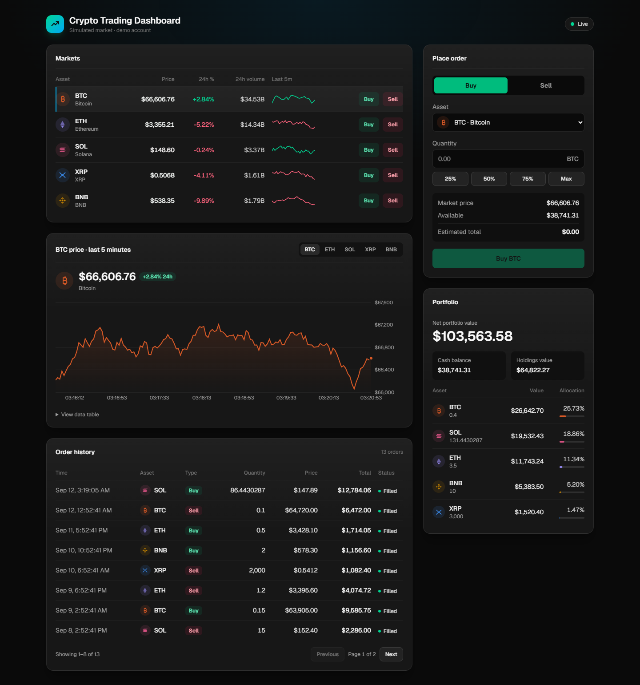
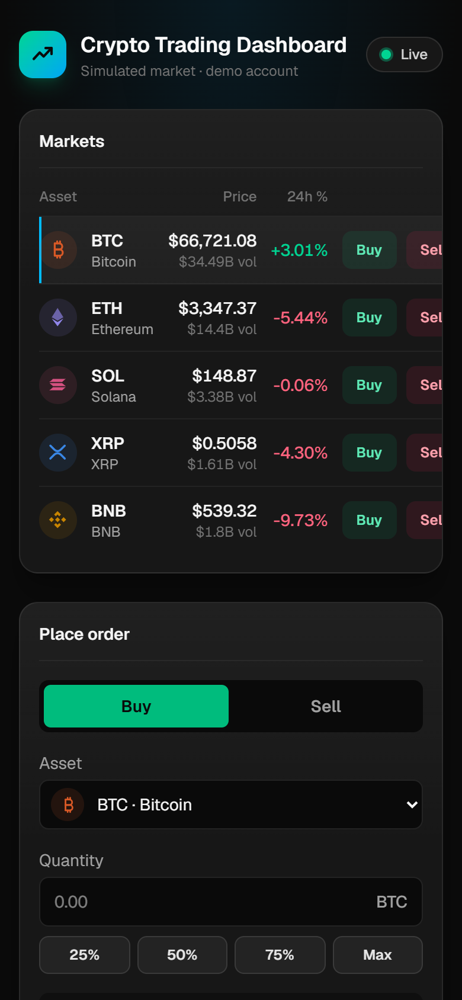

# Crypto Trading Dashboard

[](https://github.com/raheel-afzal/crypto-trading-dashboard/actions/workflows/ci.yml)

Real-time trading dashboard for BTC, ETH, SOL, XRP and BNB: live prices over WebSocket, market orders with server-side validation, and portfolio tracking.





**Web:** Next.js 16, React 19, TypeScript, Tailwind 4, TanStack Query, Zustand, axios, Recharts
**API:** NestJS 12, Zod, ws · **Tests:** Vitest

## Run

Needs Node 22.12+.

```bash
npm install
npm run dev
```

Dashboard on <http://localhost:3000>, API on <http://localhost:4000>.

| Script | |
| --- | --- |
| `npm run dev` | API and web together (`dev:api` / `dev:web` for one) |
| `npm test` | API unit tests |
| `npm run lint`, `npm run typecheck` | checks (`typecheck -w server` for the API) |
| `npm run build` | web build (`build -w server` for the API) |

Sign in with **demo@trading.dev / demo1234** (or alex@trading.dev / alex1234).

Optional env: `NEXT_PUBLIC_API_URL`, `PORT`, `CORS_ORIGIN`, `JWT_SECRET` (defaults to a per-process key, so restarting the API ends open sessions).

## API

| Endpoint | |
| --- | --- |
| `POST /api/auth/login` | sign in, returns a JWT |
| `GET /api/coins` | price, 24h change, 24h volume |
| `GET /api/coins/:symbol/history` | last 5 minutes of ticks |
| `GET /api/portfolio` | cash balance and holdings |
| `GET /api/orders` | complete order history |
| `POST /api/orders` | place a market order |
| `ws://localhost:4000/ws` | snapshot on connect, then a frame every 2s |

Portfolio and order routes need an `Authorization: Bearer <token>` header; market data and the socket are public.

An order fills at the live market price when the submitted price is within 1% of it. Bad input returns 400; slippage, insufficient holdings and insufficient cash return 422 with an `errorCode` and a readable message.

## Notes

- Data lives in memory and resets when the API restarts: each account starts with $100,000 and a short trade history, and tokens scope every request to one account.
- Orders apply to the UI immediately and roll back to the pre-order snapshot if the server rejects them.
